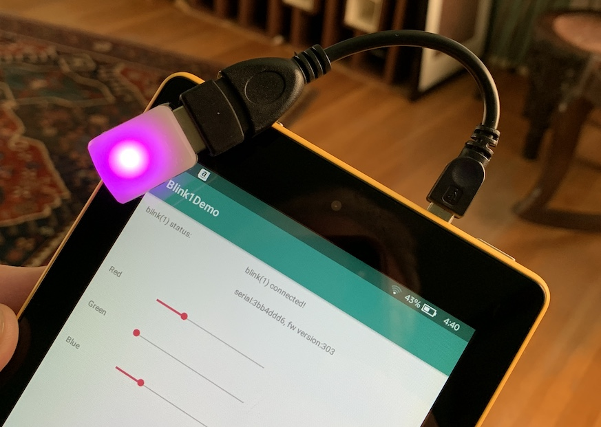

# blink1-android


This is a driver library for communicating with [blink(1) USB RGB LED notification lights](https://blink1.thingm.com/), using the [Android USB Host Mode (OTG)](http://developer.android.com/guide/topics/connectivity/usb/host.html), available since Android 3.1 and working reliably since Android 4.2.

No root access or special kernel drivers required.
The library is 100% Java, using standard Android libraries.



## Hardware requirements
To use a blink(1) USB light with an Android device, you will need:

* Device running Android 4.2 or later
* Device must support USB OTG (check with [this app](http://bit.ly/2upSUOG))
* USB OTG cable (like [this one](http://amzn.com/B00LN3LQKQ?tag=todbotblog-20))
* A [blink(1) USB LED](https://blink1.thingm.com/) device

## Downloading Library
You can clone the library as a git submodule or download full source code.

## Quick Start

**1.** Add library to your project:
* Get library
    ```
    git clone https://github.com/todbot/blink1-android
    ```
* Add to your project via "File -> New -> Import Module..."
* Set as dependency via "File -> Project Structure... -> Dependencies -> '+' -> Module Dependency"

**2.** If the app should be notified when a device is attached, add
[device_filter.xml](blink1/app/src/main/res/xml/device_filter.xml)
to your project's `res/xml/` directory and configure in your `AndroidManifest.xml`.

```xml
<activity
    android:name="..."
    ...>
    <intent-filter>
        <action android:name="android.hardware.usb.action.USB_DEVICE_ATTACHED" />
    </intent-filter>
    <meta-data
        android:name="android.hardware.usb.action.USB_DEVICE_ATTACHED"
        android:resource="@xml/device_filter" />
</activity>
```

**3.** Use it!

Example code snippet:

Open blink(1) device using [Blink1Finder](blink1/src/main/java/com/thingm/blink1/Blink1Finder.java):
```java
private static final String ACTION_USB_PERMISSION = "com.thingm.blink1demo.action.USB_PERMISSION";
PendingIntent permissionIntent = PendingIntent.getBroadcast(this, 0, new Intent(ACTION_USB_PERMISSION), 0);

Blink1Finder blink1Finder = new Blink1Finder();
blink1Finder.setContext(this);
blink1Finder.setPermissionIntent(permissionIntent);

Blink1 blink1 = blink1Finder.openFirst();     
```

then use [Blink1](blink1/src/main/java/com/thingm/blink1/Blink1.java) API to control the blink(1):

```java
  int r = 255;
  int g = 0;
  int b = 255;
  blink1.fadeToRGB(100, r,g,b ); // 100 msecs to fade to purple
  String serialnumber = blink1.getSerialNumber();

```

For a simple example, see the [`Blink1Demo`](app/src/main/java/com/thingm/blink1demo/MainActivity.java) app in the repo.


## Development

If you want to work on this app, you'll need to set up your development
environment.  Beyond installing Android Studio, you will need to to
set up ADB to use WiFi instead of USB. (So the USB port is free for blink(1))

Here's one way to do that: https://medium.com/@amanshuraikwar.in/connecting-to-android-device-with-adb-over-wifi-made-a-little-easy-39439d69b86b
